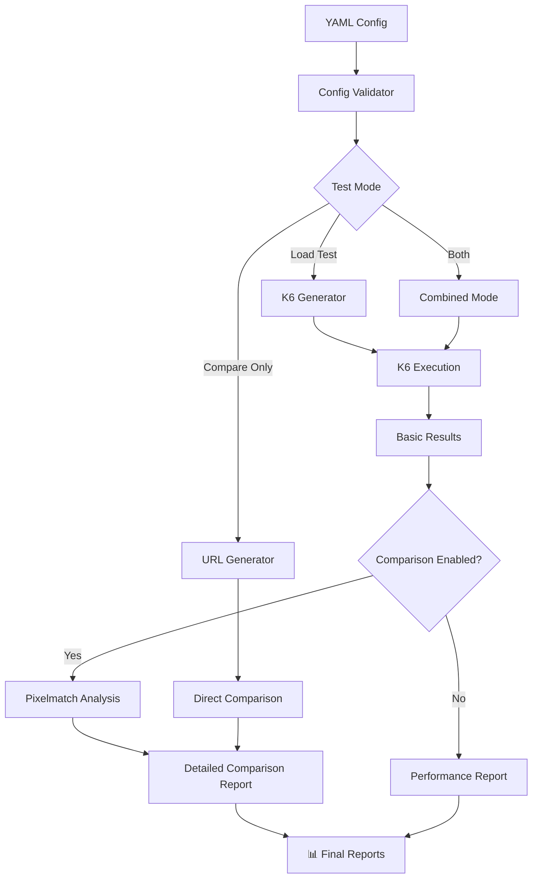

# Synapse

> 🚀 **Dynamic Load Testing + Version Comparison** - The Ultimate API Testing Powerhouse

Synapse is a revolutionary command-line tool that combines **high-performance K6 load testing** with **intelligent version comparison**. Generate complex test scenarios from simple YAML configurations and automatically compare different API versions, environments, or deployments.

## 🌟 What Makes Synapse Special?

### ⚡ **Dual-Power Testing**
- **Load Testing** - Stress test your APIs with K6's proven engine
- **Version Comparison** - Automatically compare responses between different versions
- **Combined Analysis** - Get performance AND quality metrics in one run

### 🎯 **Smart Comparison Engine**
- **Image Comparison** - Pixel-perfect analysis using advanced algorithms
- **Text Comparison** - Exact content matching for API responses  
- **Universal Format Support** - PNG, JPEG, WebP, GIF, and more
- **Intelligent Reporting** - Detailed similarity scores and difference analysis

### 🔄 **Version Testing Made Easy**
```bash
# Compare v1 vs v2 APIs under load
synapse run --compare

# Test image generation between environments  
synapse run --compare-only

# Standalone comparison from CSV
synapse compare --file urls.csv --type image
```

## 🚀 Features

- 🎯 **Dynamic URL Construction** - Build complex URLs with configurable parameters
- 📊 **Multiple Parameter Types** - Integer, string, array, CSV, static, and URL parameters
- 🔄 **Batch Mode** - Use pre-built URLs from CSV files
- ⚡ **K6 Integration** - Full K6 feature support with automatic script generation
- 🖼️ **Image Comparison** - Pixel-perfect comparison with similarity scoring
- 📝 **Text Comparison** - Exact content matching for API responses
- 🎨 **Universal Image Support** - PNG, JPEG, WebP, GIF, TIFF, AVIF, HEIF, SVG
- 📈 **Performance Metrics** - Comprehensive load testing results
- 🛠️ **CLI Interface** - Easy-to-use command-line interface
- 🔍 **Detailed Reporting** - CSV and JSON reports with complete analysis

## 🎨 Version Comparison in Action

### 🖼️ **Image API Testing**
Perfect for testing image generation, resizing, or processing APIs:

```yaml
name: "Image API v1 vs v2 Comparison"
baseUrl: "https://v1.imageapi.com/generate"
execution:
  concurrent: 10
  iterations: 50
parameters:
  - name: "prompt"
    type: "array"
    values: ["sunset", "mountain", "ocean"]
  - name: "size"
    type: "static"
    value: "512x512"
comparison:
  enabled: true
  type: "image"
  baseUrl2: "https://v2.imageapi.com/generate"
  threshold: 0.1  # 90% similarity required
```

### 📊 **API Response Comparison**
Compare text responses between different API versions:

```yaml
name: "Search API Comparison"
baseUrl: "https://api-v1.example.com/search"
comparison:
  enabled: true
  type: "text"
  baseUrl2: "https://api-v2.example.com/search"
```

### 🎯 **What You Get**
- **Performance Data** - Response times under load
- **Similarity Scores** - Exact percentage match between versions
- **Visual Differences** - Pixel-by-pixel analysis for images
- **Error Detection** - Automatic identification of failures
- **Comprehensive Reports** - CSV and JSON formats for analysis

## 🚀 Quick Start

### Installation

```bash
npm install -g synapse
```

### 1️⃣ **Simple Load Test**
```bash
synapse test --url "https://api.example.com" --concurrent 10 --requests 100
```

### 2️⃣ **Version Comparison**
```bash
# Initialize with comparison config
synapse init --name "Version Test" --url "https://v1.api.com"

# Run load test + comparison
synapse run --compare

# Compare only (no load test)
synapse run --compare-only
```

### 3️⃣ **Standalone Comparison**
```bash
# Compare images from CSV
synapse compare --file image-urls.csv --type image

# Compare API responses
synapse compare --file endpoints.csv --type text
```

## 🎯 Use Cases

### 🔄 **API Version Migration**
- Compare old vs new API responses
- Ensure backward compatibility
- Validate response consistency

### 🖼️ **Image Processing APIs**
- Test image generation algorithms
- Compare different AI models
- Validate image transformations

### 🌍 **Environment Testing**
- Dev vs Staging vs Production
- A/B testing different configurations
- Cross-region consistency checks

### 📊 **Performance Regression**
- Load test + quality assurance
- Detect performance AND visual regressions
- Continuous integration testing

## 🏗️ Architecture Overview



## 📊 Parameter Types

Synapse supports multiple parameter types for flexible URL construction:

| Type | Description | Example | Auto-Encoding |
|------|-------------|---------|---------------|
| `integer` | Random integers within range | `userId: 1-1000` | ✅ |
| `string` | Random strings with charset | `sessionId: alphanumeric` | ✅ |
| `array` | Values from predefined array | `category: [tech, business]` | ✅ |
| `csv` | Values from CSV file column | `region: regions.csv` | ✅ |
| `url` | URLs with optional encoding | `encoded URLs` | ✅ |
| `static` | Fixed values with smart encoding | `apiKey: "sk-123"` | ✅ |

## 🎨 Example: Complete Version Comparison

```yaml
name: "Image Resizer API Comparison"
baseUrl: "https://v1.resizer.com/api"
execution:
  mode: "construct"
  concurrent: 5
  iterations: 20
parameters:
  - name: "img"
    type: "static"
    value: "https://example.com/test-image.jpg"
  - name: "width"
    type: "integer"
    min: 100
    max: 800
  - name: "height"
    type: "integer"
    min: 100
    max: 600
  - name: "quality"
    type: "array"
    values: [80, 90, 95]
comparison:
  enabled: true
  type: "image"
  baseUrl2: "https://v2.resizer.com/api"
  threshold: 0.05  # Very strict comparison
  timeout: 30000
k6Options:
  thresholds:
    http_req_duration: ["p(95)<2000"]
    http_req_failed: ["rate<0.1"]
```

**Run with:**
```bash
synapse run --compare
```

**Get:**
- ⚡ **Load test results** - Performance under concurrent load
- 🖼️ **Image comparison** - Pixel-perfect similarity analysis  
- 📊 **Detailed reports** - CSV with response times, similarity scores, dimensions
- 🎯 **Quality metrics** - Success rates, average similarity, error analysis

## 🌟 Why Choose Synapse?

### 🚀 **Performance + Quality**
- Don't choose between load testing OR comparison testing
- Get both performance metrics AND quality assurance
- One tool, complete testing solution

### 🎯 **Developer-Friendly**
- Simple YAML configuration
- Automatic script generation
- Rich CLI interface with helpful output

### 🔧 **Production-Ready**
- Built on proven K6 engine
- Advanced image processing with Sharp
- Comprehensive error handling and reporting

### 📈 **Scalable**
- Handle thousands of comparisons
- Support for all major image formats
- Efficient parallel processing

---

**Ready to revolutionize your API testing?** 

[Get Started →](getting-started.md) | [View Examples →](examples.md) | [CLI Reference →](cli-reference.md)
