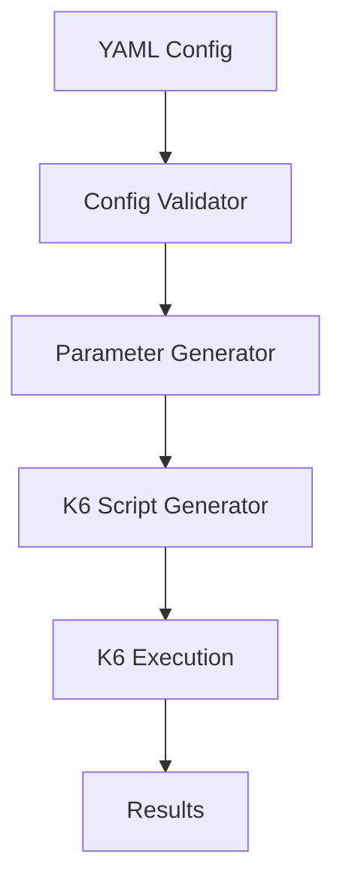

# Architecture

## Overview

Synapse follows a modular architecture that separates concerns between configuration validation, parameter generation, and K6 script execution.

## Core Components

### Configuration Validator
- Validates YAML configuration using Joi schema
- Ensures all required fields are present
- Validates parameter types and options

### Parameter Generators
- **IntegerGenerator**: Generates random integers with optional padding
- **StringGenerator**: Creates random strings with configurable character sets
- **ArrayGenerator**: Selects random values from predefined arrays
- **CSVGenerator**: Loads values from CSV files
- **URLGenerator**: Handles URL loading and encoding

### K6 Script Generator
- Converts validated configuration to executable K6 JavaScript
- Handles both construct and batch execution modes
- Integrates all K6 options and scenarios

### CLI Interface
- Built with Commander.js
- Supports init, run, validate, and generate commands
- Provides dry-run and output options

## Execution Modes

### Construct Mode
Dynamically builds URLs using base URL and parameters:
1. Load and validate configuration
2. Generate parameter values
3. Construct URLs using template
4. Execute K6 test

### Batch Mode
Uses pre-built URLs from CSV files:
1. Load and validate configuration
2. Read URLs from CSV file
3. Execute K6 test with URL list

## Data Flow

1. **Input**: YAML configuration file
2. **Validation**: Schema validation and type checking
3. **Generation**: Parameter value generation
4. **Script Creation**: K6 JavaScript generation
5. **Execution**: K6 test execution
6. **Output**: Test results and metrics
